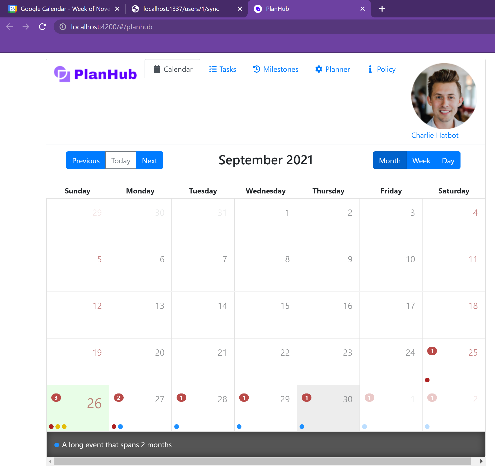
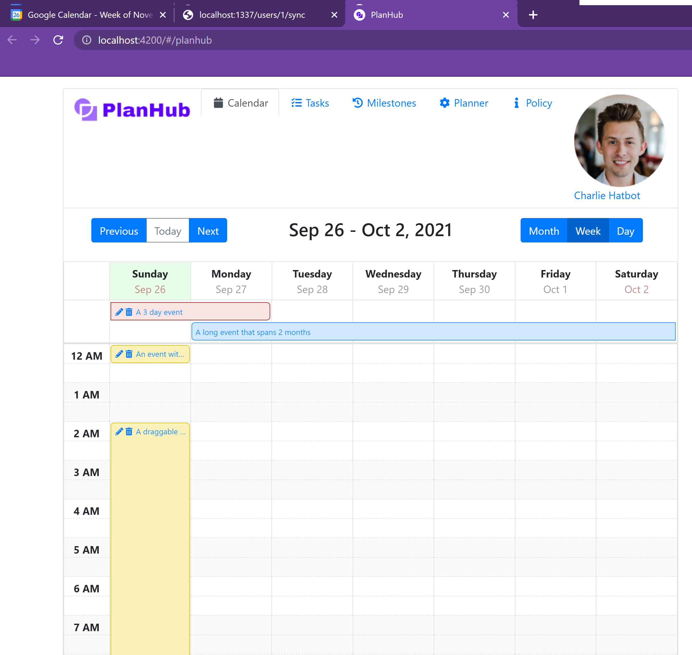
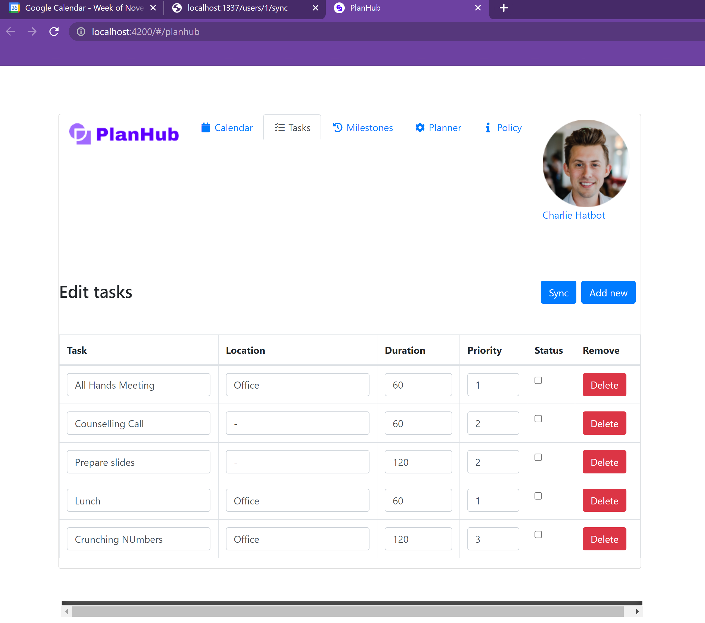
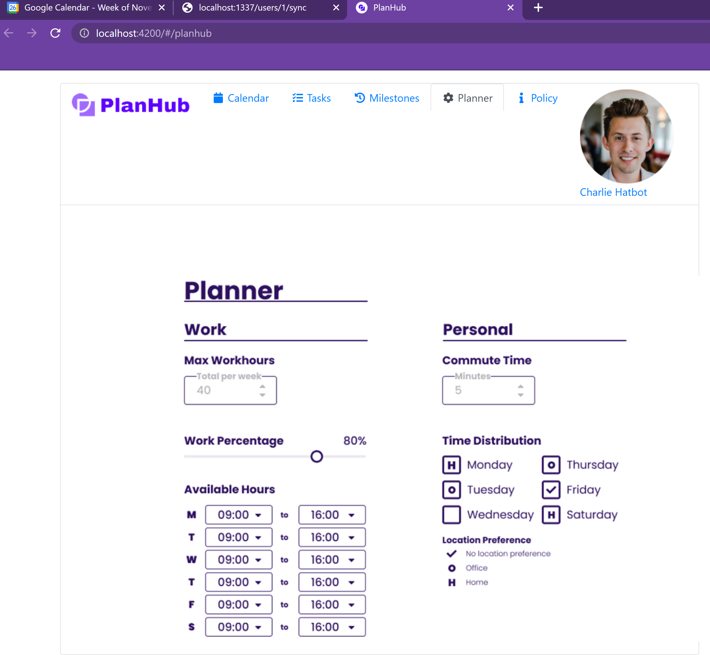

<h1 align="center">PlanHub - Hack Zürich</h1>


<div align="center">
  <a href="https://youtu.be/vtcxTMx-acM">Watch the Presentation and Tech Demo</a>

<h2 align="center">About</h2>

A smart meeting planning and organization tool to help navigate in a hybrid work environment.

This is based on the calendar component for Angular 6.0+ that can display events on a month, week or day view. The successor of [angular-bootstrap-calendar](https://github.com/mattlewis92/angular-bootstrap-calendar).

<h2 align="center">What it looks like</h2>










<h2 align="center">Set up</h2>

## Install dependencies

### python

`cd backend`

`pip install -r requirements.txt`
`pip install greenlet`
`pip install mysqlclient`

### Angular

`npm install`


### Prepare the database

Run the local mysql service on your machine. Update the connection string in the backend/config.py file.

Copy paste the database/table_creation into the mysql console. (This step is only needed once)

### Prepare the Google Calendar

Go to the GCP Console and create a new user secret credential file for your gmail address.

Copy paste the content into the file backend/client_secret_GoogleCloudDemo.json


<h2 align="center">Run the code</h2>

## python

`cd backend`

`python main.py`

## Angular

`npm run start`

<h2 align="center">Access the Web App</h2>

Navigate to http://localhost:4200

<h2 align="center">Getting started with Angular</h2>

### ng add (recommended)

```sh
ng add angular-calendar
```

### Manual setup (ng add will do this all for you)

First install through npm:

```bash
npm install --save angular-calendar date-fns
```

Next include the CSS file in the global (not component scoped) styles of your app:

```
/* angular-cli file: src/styles.css */
@import "../node_modules/angular-calendar/css/angular-calendar.css";
```

Finally import the calendar module into your apps module:

```typescript
import { NgModule } from '@angular/core';
import { BrowserAnimationsModule } from '@angular/platform-browser/animations';
import { CalendarModule, DateAdapter } from 'angular-calendar';
import { adapterFactory } from 'angular-calendar/date-adapters/date-fns';

@NgModule({
  imports: [
    BrowserAnimationsModule,
    CalendarModule.forRoot({
      provide: DateAdapter,
      useFactory: adapterFactory,
    }),
  ],
})
export class MyModule {}
```

In order to allow the most flexibility for all users there is a substantial amount of boilerplate required to get up and running. Please see the [demos list](https://mattlewis92.github.io/angular-calendar/) for a series of comprehensive examples of how to use this library within your application.

Once you are up and running, to access a full list of options for each component, the individual APIs are documented here: [`mwl-calendar-month-view`](https://mattlewis92.github.io/angular-calendar/docs/components/CalendarMonthViewComponent.html), [`mwl-calendar-week-view`](https://mattlewis92.github.io/angular-calendar/docs/components/CalendarWeekViewComponent.html) and [`mwl-calendar-day-view`](https://mattlewis92.github.io/angular-calendar/docs/components/CalendarDayViewComponent.html).

If you would like a one on one consultation with me where I can show you the best way to integrate and customise this calendar within your application, then you can get this by becoming a Platinum Sponsor on [GitHub](https://github.com/users/mattlewis92/sponsorship).

> Please note: angular-calendar uses [Scarf](https://scarf.sh/) to collect anonymized installation analytics. These analytics help support the maintainers of this library. However, if you'd like to opt out, you can do so by setting `scarfSettings.enabled = false` in your project's package.json. Alternatively, you can set the environment variable `SCARF_ANALYTICS=false` before you install.

### Module bundlers

You can find quick start examples for all common module bundlers in the [build-tool-examples](https://github.com/mattlewis92/angular-calendar/tree/master/build-tool-examples) folder.

<h2 align="center">Documentation</h2>

To see all available API options, take a look at the auto generated [documentation](https://mattlewis92.github.io/angular-calendar/docs/). You may find it helpful to view the examples on the demo page.

<h2 align="center">Development</h2>

### Prepare your environment

- Install [Node.js](http://nodejs.org/) and NPM (should come with)
- Install local dev dependencies: `npm install` while current directory is this repo

### Development server

Run `npm start` to start a development server on port 8000 with auto reload + tests.

### Testing

Run `npm test` to run tests once or `npm run test:watch` to continually run tests.
